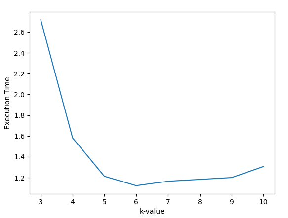
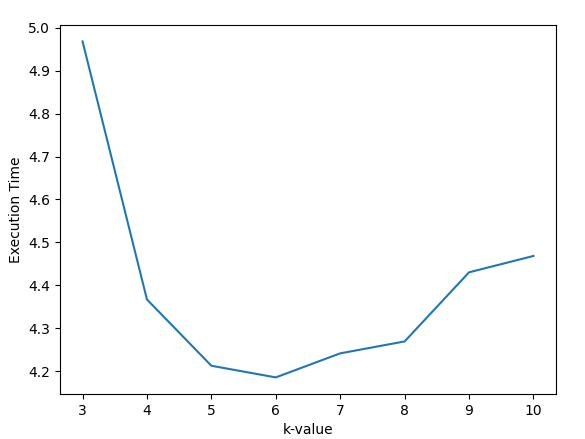

# K-Mer-Counting

Team Members :

1. Anmoldeep Kaur Dhillon (2020101085)  
2. Aryan Gupta (2020101091)

In bioinformatics, k-mers are substrings of length k contained within a biological sequence.  
So, a sequence of length L will have L-k+1  k-mers and n^k total possible k-mers, where n is number of possible monomer.    
For a given K we count the number of all occurrences of K-mer in the sequence.  
K-mer counting is very a simple task if we do not care about efficiency , however,  that efficient execution of this task, with reasonable memory use, is far from trivial . 

Since, the problem highly depends on the length of sequence given and the value of k, we divided our problem into 3 cases:  
1. Small sequence size (less than 256 MB) and k<13.
2. Small sequence size (less than 256 MB) and k<13.
3. k>=13

For small k , we directly store all possible combinations in a map and maintain count , however for large k , we implemented Bloom filters with min alignment , sorting and compression . 

The results can be found in the attached pdf .

The file structure is as follows :

a) baseline_large_dna.cpp : The baseline code for the case of small k (<15) and small data size (around 250 MB) . 
b) baseline_small_k_large_dna.cpp : The baseline code for the case of small k (<15) and large data size (> 2GB) . 
c) baseline_large_k.cpp : The baseline code for the case of small k (<15) and large data size (> 2GB) . 
d) small_k_small_dna.cpp : The optimised code for small k and small dna. 
e) small_k_large_dna.cpp : The optimised code for small k and large dna. 
f) large_k.cpp : The optimised code for large k. 
 
We obtained the following result for large and small data set respectively :

